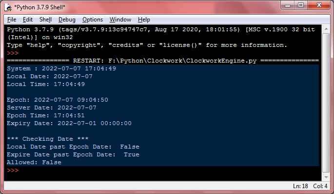

# Clockwork-Engine
Acquires date and time from both local system and server
Uses Native-Python datetime library and just-the-time (GoogleWebApplication) aleaxit(Alex Martelli)

Simple Date and Time acquisition script
for timestamping or comparative function

